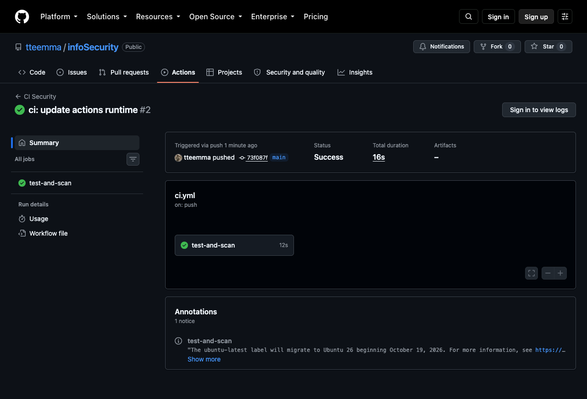
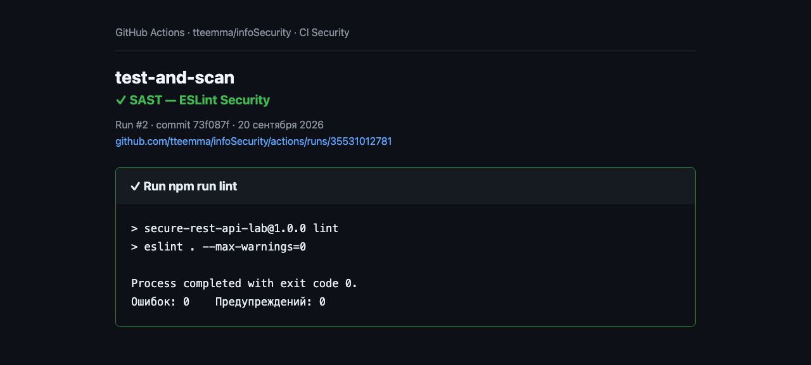
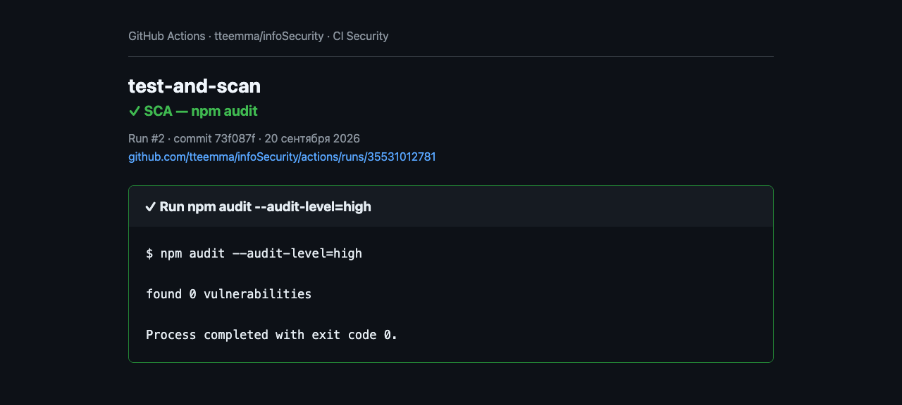

# Лабораторная работа № 1 — защищённый REST API

Учебный REST API на JavaScript: Express, SQLite, JWT, bcrypt и автоматические
проверки безопасности в GitHub Actions.

[](https://github.com/tteemma/infoSecurity/actions/workflows/ci.yml)

- Публичный репозиторий: <https://github.com/tteemma/infoSecurity>
- Последний успешный pipeline: <https://github.com/tteemma/infoSecurity/actions/workflows/ci.yml?query=branch%3Amain+is%3Asuccess>

## Возможности API

| Метод | Путь | Назначение | Доступ |
|---|---|---|---|
| `POST` | `/auth/login` | Аутентификация и получение JWT | Публичный |
| `GET` | `/api/data` | Получение списка постов | Только с JWT |
| `POST` | `/api/posts` | Создание поста | Только с JWT |

## Запуск

Требуется Node.js 24 или новее.

```bash
npm ci
cp .env.example .env
npm start
```

Значения `DEMO_LOGIN` и `DEMO_PASSWORD` используются только при первом запуске
для создания учебного пользователя. В SQLite записывается bcrypt-хэш, а не
открытый пароль. Для реального размещения обязательно замените `JWT_SECRET` и
демонстрационный пароль.

## Примеры запросов

Вход:

```bash
curl -s http://localhost:3000/auth/login \
  -H 'Content-Type: application/json' \
  -d '{"login":"student","password":"ChangeMe123!"}'
```

Скопируйте поле `token` из ответа:

```bash
TOKEN='полученный-JWT'
```

Получение данных:

```bash
curl -s http://localhost:3000/api/data \
  -H "Authorization: Bearer $TOKEN"
```

Создание поста:

```bash
curl -s http://localhost:3000/api/posts \
  -X POST \
  -H 'Content-Type: application/json' \
  -H "Authorization: Bearer $TOKEN" \
  -d '{"title":"Первый пост","content":"Безопасный текст"}'
```

Без заголовка `Authorization` защищённые методы возвращают HTTP 401.

## Реализованные меры защиты

### SQL Injection

Все значения передаются в SQLite отдельно от SQL-текста через placeholders
`?` и prepared statements. Пользовательский ввод не объединяется со строкой
SQL. Например, поиск пользователя выполняется выражением
`SELECT ... WHERE login = ?`.

### XSS

API возвращает JSON, а не HTML. Дополнительно все хранимые пользовательские
строки (`title`, `content`, имя автора) перед включением в ответ проходят
HTML-экранирование: `<`, `>`, `&`, кавычки преобразуются в безопасные сущности.
Также Helmet устанавливает защитные HTTP-заголовки.

### Аутентификация

- пароль хэшируется bcrypt с cost factor 12;
- после успешного входа сервер выдаёт подписанный JWT с ограниченным сроком;
- middleware проверяет подпись, алгоритм `HS256` и срок JWT на всех `/api/*`;
- секрет JWT берётся из окружения и должен содержать минимум 32 символа;
- endpoint входа ограничен десятью попытками в минуту с одного адреса.

## Проверки

```bash
npm test
npm run lint
npm audit --audit-level=high
```

Интеграционные тесты проверяют вход, JWT-защиту, валидацию, SQLi-попытку,
XSS-экранирование и bcrypt-хэш. ESLint Security выполняет SAST, а `npm audit`
выполняет SCA — проверку зависимостей на известные уязвимости.

Workflow [`.github/workflows/ci.yml`](.github/workflows/ci.yml) запускает все
проверки при каждом `push` и `pull_request`.

### Результаты GitHub Actions

Успешный запуск всего pipeline:



SAST — ESLint Security завершён без ошибок и предупреждений:



SCA — `npm audit` не обнаружил известных уязвимостей:



## Структура

```text
src/
├── middleware/       # проверка JWT
├── repositories/     # параметризованные SQL-запросы
├── security/         # безопасное представление выходных данных
├── services/         # аутентификация
├── app.js             # маршруты и сборка приложения
├── config.js          # конфигурация окружения
├── database.js        # схема SQLite
└── server.js          # запуск HTTP-сервера
```

Репозитории отвечают только за хранение, `AuthService` — за аутентификацию,
middleware — за контроль доступа. Зависимости передаются через конструкторы.
Так код следует KISS, DRY и основным принципам ООП без избыточных слоёв.

## Материалы для сдачи

- PDF-отчёт: `docs/report.pdf`.
- Ответы на контрольные вопросы: `docs/control-questions.md`.
- Публичный репозиторий: <https://github.com/tteemma/infoSecurity>.
- Последний успешный pipeline: <https://github.com/tteemma/infoSecurity/actions/workflows/ci.yml?query=branch%3Amain+is%3Asuccess>.
